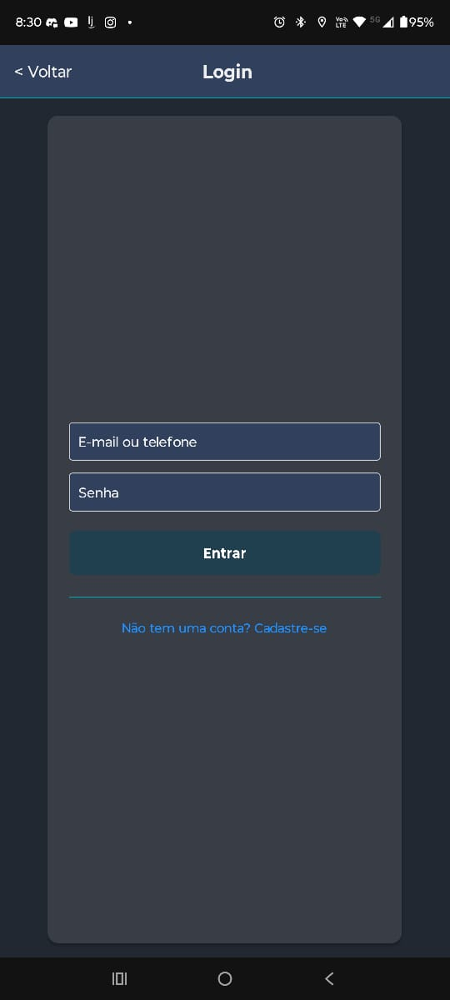
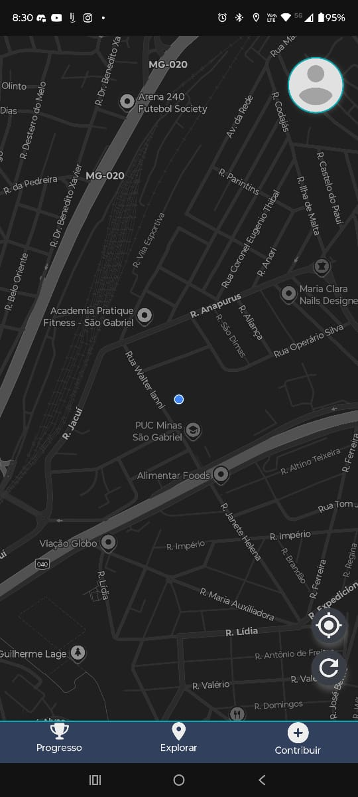
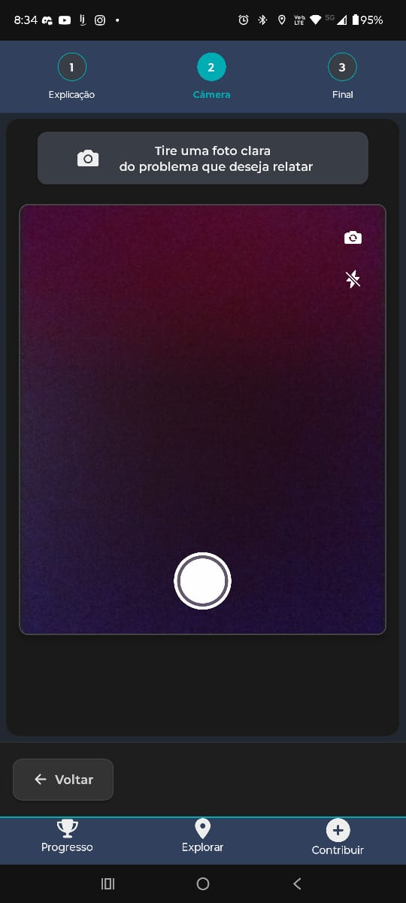

# 4. Projeto da Solução

## 4.1 Arquitetura da Solução


> **Figura 4.1** – Diagrama de componentes e fluxos da solução.

---

## 4.2 Protótipos de Telas

A seguir, alguns protótipos ilustrativos das principais telas do aplicativo:

<div align="center">

  <figure style="display: inline-block; margin: 8px;">
    
    <figcaption><em>Figura 1. Tela de Login</em></figcaption>
  </figure>

  <figure style="display: inline-block; margin: 8px;">
    
    <figcaption><em>Figura 2. Mapa Principal</em></figcaption>
  </figure>

</div>

<div align="center">

  <figure style="display: inline-block; margin: 8px;">
    
    <figcaption><em>Figura 3. Reporte (Visão Geral)</em></figcaption>
  </figure>

  <figure style="display: inline-block; margin: 8px;">
    
    <figcaption><em>Figura 4. Reporte via Câmera</em></figcaption>
  </figure>

</div>

---

## 4.3 Modelagem de Dados

### 4.3.2 Modelo Entidade-Relacionamento (ER)

#### 4.3.2.1 Modelo Relacional


#### 4.3.2.2 Modelo Físico

O script DDL completo está em:  
```txt
../src/db/green-drop.sql
```

### 4.4 Tecnologias
| Camada                       | Tecnologias Principais                                                                   | Ferramentas / Observações                                                                                                                                                                                                                        |
| ---------------------------- | ---------------------------------------------------------------------------------------- | ------------------------------------------------------------------------------------------------------------------------------------------------------------------------------------------------------------------------------------------------ |
| **Frontend Mobile**          | React Native (JavaScript/TypeScript)                                                     | • UI: React Native Paper, Native Base<br>• APIs nativas: Expo (ImagePicker, Location), React Native Maps<br>• Estado global: Context API, Redux<br>• Navegação: React Navigation<br>• HTTP: Axios ou fetch                                       |
| **Frontend Web**             | React (JavaScript/TypeScript)                                                            | • UI: Material-UI, Ant Design<br>• Rotas: React Router<br>• Autenticação/autorização: JWT (localStorage/memória)<br>• Build: Webpack, Vite<br>• Testes: Jest, React Testing Library                                                              |
| **Backend (Microservices)**  | Spring Boot 3+                                                                           | • Web: Spring Web (MVC/WebFlux)<br>• Persistência: Spring Data JPA (PostgreSQL)<br>• Segurança: Spring Security (JWT)<br>• Monitoramento: Spring Boot Actuator<br>• API: springdoc-openapi/Swagger<br>• Inter-serviços: WebClient/Feign/RabbitMQ |
| **Banco de Dados**           | PostgreSQL (+ PostGIS)                                                                   | • Instância/schema dedicado por serviço<br>• Consultas geoespaciais via PostGIS<br>• Possível uso de NoSQL (ex: logs)                                                                                                                            |
| **Armazenamento de Imagens** | AWS S3 (ou MinIO on-premise)                                                             | Upload de fotos via serviço de reportes, armazenamento de URL pública/assinada e distribuição via CDN; evita BLOBs no banco                                                                                                                      |
| **Testes Automatizados**     | JUnit 5; Spring Boot Test; Jest; React Testing Library; Enzyme; Postman/Newman; Cucumber | • Unitários (backend/frontend)<br>• Integração (H2, Docker-PostgreSQL)<br>• Interface (componentes React/React Native)<br>• Contrato/API end-to-end                                                                                              |
| **CI/CD**                    | GitHub Actions (ou GitLab CI)                                                            | • Pipelines de lint, build (Docker, bundling frontend), testes<br>• Deploy via Docker Compose, scripts em VM ou Kubernetes<br>• Versionamento com Git e branches estruturadas (dev/prod)                                                         |
