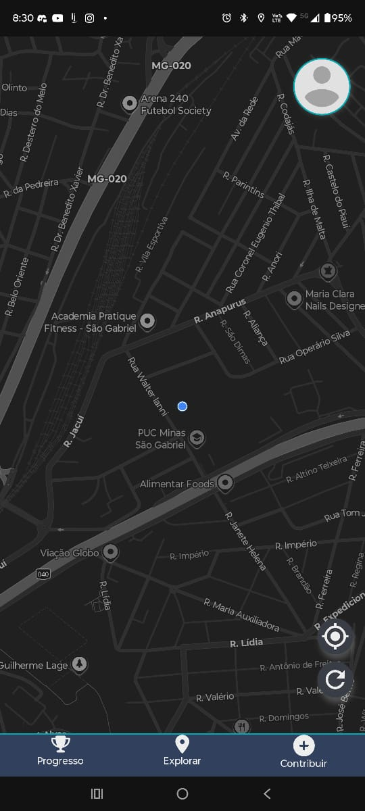
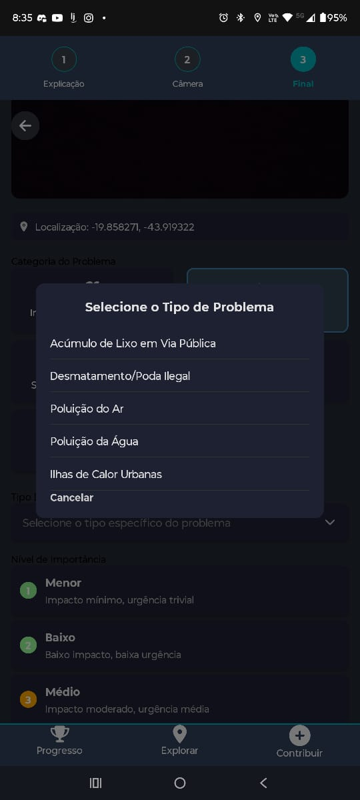
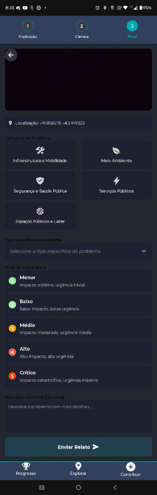
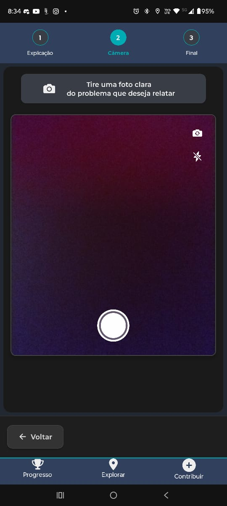
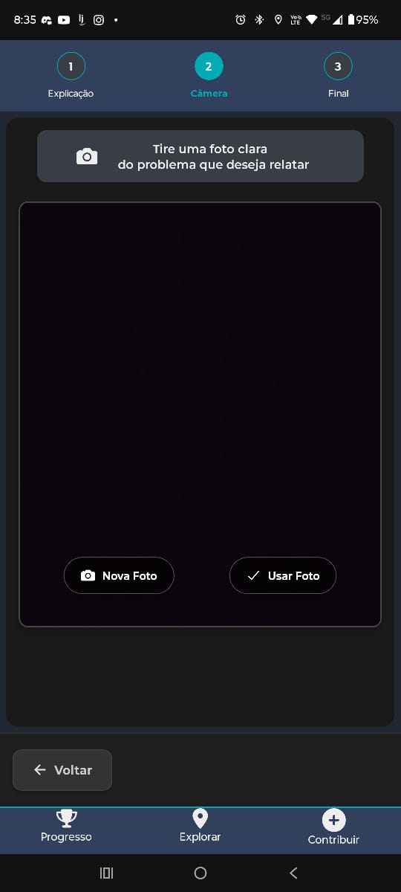
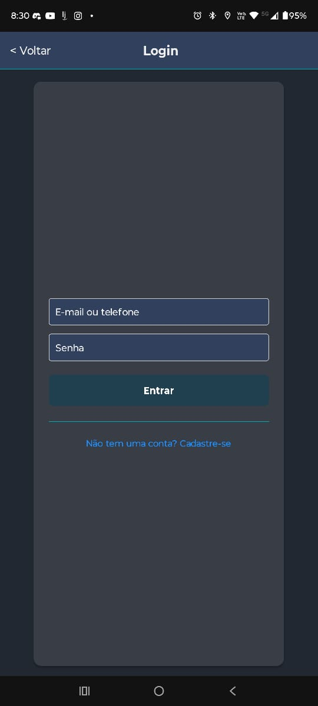
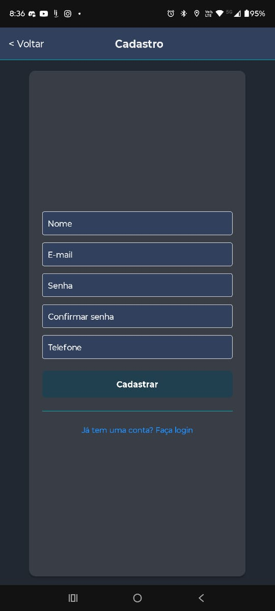
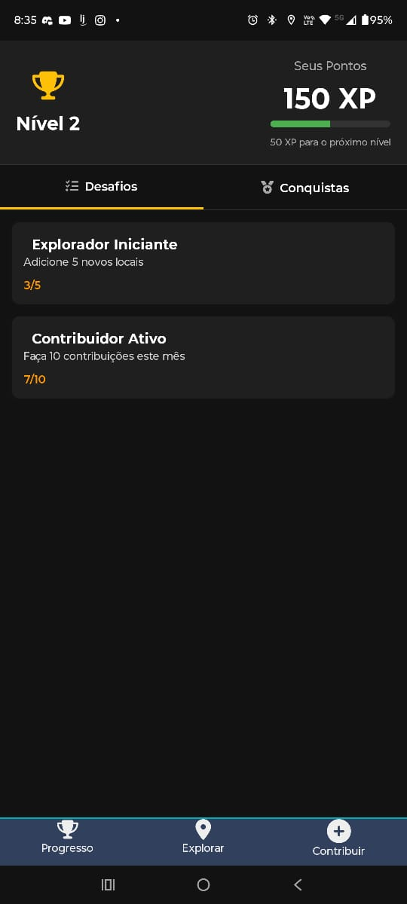
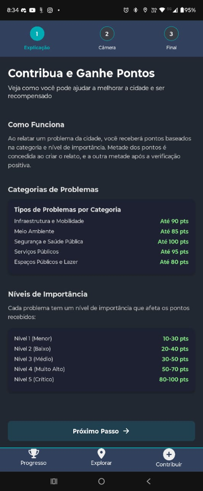

# 5. Interface do Sistema

## 5.1 Tela principal do sistema

  <figure style="display:inline-block; margin:8px;">
    
    <figcaption><em>Figura 5.1. Tela Principal do Sistema</em></figcaption>
  </figure>

---

## 5.2 Telas do processo de reporte

  <figure style="display:inline-block; margin:8px;">
    
    <figcaption><em>Figura 5.2.1. Reporte – Atividade 1</em></figcaption>
  </figure>
  <figure style="display:inline-block; margin:8px;">
    
    <figcaption><em>Figura 5.2.2. Reporte – Atividade 2</em></figcaption>
  </figure>

  <figure style="display:inline-block; margin:8px;">
    
    <figcaption><em>Figura 5.2.3. Reporte via Câmera – Atividade 1</em></figcaption>
  </figure>
  <figure style="display:inline-block; margin:8px;">
    
    <figcaption><em>Figura 5.2.4. Reporte via Câmera – Atividade 2</em></figcaption>
  </figure>

---

## 5.3 Telas das informações do usuário

  <figure style="display:inline-block; margin:8px;">
    
    <figcaption><em>Figura 5.3.1. Tela de Login</em></figcaption>
  </figure>
  <figure style="display:inline-block; margin:8px;">
    
    <figcaption><em>Figura 5.3.2. Tela de Cadastro</em></figcaption>
  </figure>

  <figure style="display:inline-block; margin:8px;">
    
    <figcaption><em>Figura 5.3.3. Tela de Pontos</em></figcaption>
  </figure>
  <figure style="display:inline-block; margin:8px;">
    
    <figcaption><em>Figura 5.3.4. Tela de Conquistas</em></figcaption>
  </figure>

  <figure style="display:inline-block; margin:8px;">
    
    <figcaption><em>Figura 5.3.5. Tela Sobre</em></figcaption>
  </figure>

